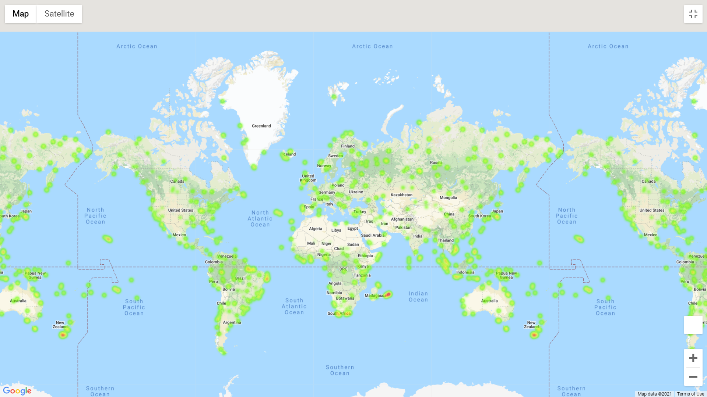
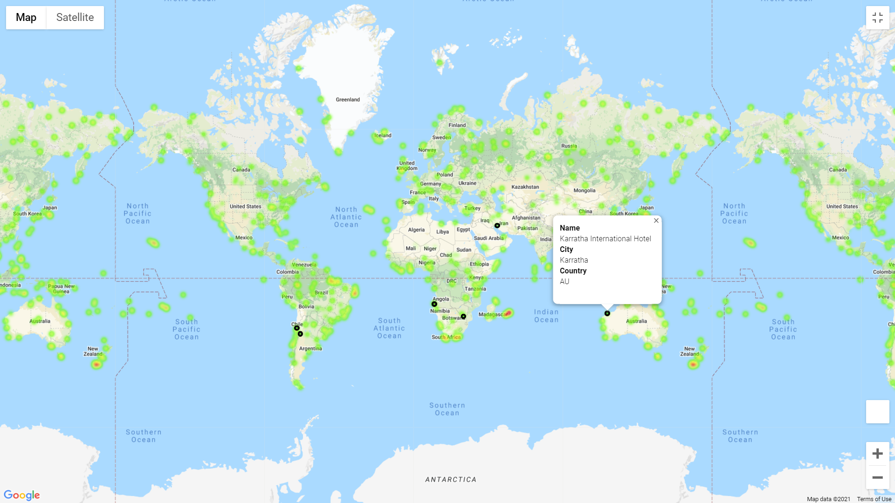

# Python API Homework 

## Background

This project involves working with Python requests, API’s, JSON, and visualization techniques to demonstrate weather patterns around the world, as well as select vacation spots based on certain criteria. 

## WeatherPy

This activity included creating a Python script to visualize 500+ cities across the world of varying distances from the equator. 

Scatter plots were created to demonstrate the relationship between the following: 

* Temperature (F) vs. Latitude
* Humidity (%) vs. Latitude
* Cloudiness (%) vs. Latitude
* Wind Speed (mph) vs. Latitude

These plots were then separated into Northern and Southern Hemispheres with linear regressions added to better identify trends in weather patterns: 

* Northern Hemisphere - Temperature (F) vs. Latitude
* Southern Hemisphere - Temperature (F) vs. Latitude
* Northern Hemisphere - Humidity (%) vs. Latitude
* Southern Hemisphere - Humidity (%) vs. Latitude
* Northern Hemisphere - Cloudiness (%) vs. Latitude
* Southern Hemisphere - Cloudiness (%) vs. Latitude
* Northern Hemisphere - Wind Speed (mph) vs. Latitude
* Southern Hemisphere - Wind Speed (mph) vs. Latitude

#### Observable Trends

* The visualizations indicate that the temperature and latitude are correlated – as we get closer to the equator, temperature rises. This matches expected outcomes as the sun is shining more directly at this area of the globe resulting in warmer weather at the equator. 

* The graphs of latitude versus humidity indicate that on the selected day, the majority of cities had about 50% humidity. The northern and southern hemispheres graphs indicate that within these locations, there is a mild positive correlation between latitude and humidity.
 
* The visualizations comparing latitude and windspeed indicate that on this day across the globe, windspeed remained below 15 mph in most locations. 

##  VacationPy

This portion of the activity involved using the weather data collected from WeatherPy, gmaps, and the Google Places API to plan future vacations

To start, a heat map was created that displays the humidity for every city from WeatherPy

  

The DataFrame was then narrowed down to include only cities meeting the following weather conditions: 

  * A max temperature lower than 80 degrees but higher than 70.

  * Wind speed less than 10 mph.

  * Zero cloudiness.

The Google Places API was then used to find the first hotel for each city located within 5000 meters. These hotels were then placed on top of the humidity heatmap with each pin containing the hotel name, city, and country. 

  

* For Part I, you must include a written description of three observable trends based on the data.
* For Part II, you must include a screenshot of the heatmap you create and include it in your submission.

### Copyright

Trilogy Education Services © 2020. All Rights Reserved.

